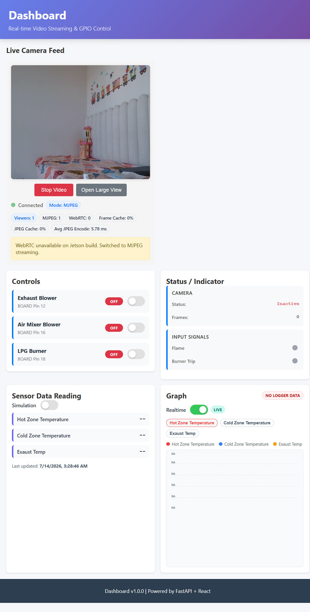

# New Local Network Deployment Guide (Beginner Friendly)

> Back to main runbook: [DEPLOYMENT.md](../DEPLOYMENT.md)

Use this guide when you move Jetson to a **new router / new local LAN** and want the dashboard reachable without chasing changing IPs.

## 1) What you will achieve

After this setup, operators can usually open:

- `http://jetson-dashboard.local/` (recommended)
- Fallback: `http://<JETSON_IPV4>/`

## 2) Visual overview

### Live view + metrics



## 3) One-time setup on Jetson

Run these on Jetson terminal:

```bash
cd /home/saurabh/Saurabh/Jetson_Nano_WebRTC_POC/jetson-nano-webrtc-dashboard
git fetch origin
git checkout -B poc_demo_v1.1.0 origin/poc_demo_v1.1.0
git reset --hard origin/poc_demo_v1.1.0
```

Make scripts executable:

```bash
chmod +x scripts/powerrun_apply_all.sh
chmod +x scripts/setup_powerrun_jetson.sh
chmod +x scripts/configure_static_ip_nmcli.sh
chmod +x scripts/check_lan_access.sh
```

## 4) Configure for a new local network

Edit config file:

```bash
nano scripts/powerrun.config
```

Beginner-safe defaults:

- Keep mDNS enabled:
  - `ENABLE_MDNS="true"`
  - `MDNS_HOSTNAME="jetson-dashboard"`
- If you are unsure about static IP in new network, keep these empty first:
  - `ETH_IP=""`
  - `WIFI_IP=""`

## 5) Apply setup and reboot

```bash
sudo ./scripts/powerrun_apply_all.sh
sudo reboot
```

This configures:

- Boot auto-start (`jetson-dashboard.service`)
- mDNS hostname (`<hostname>.local`)
- Optional static IP (if provided)

## 6) Verify after reboot (on Jetson)

```bash
cd /home/saurabh/Saurabh/Jetson_Nano_WebRTC_POC/jetson-nano-webrtc-dashboard
bash ./scripts/check_lan_access.sh
```

This prints:

- service health
- active IP/interface
- recommended operator URLs

## 7) Connect from laptop/phone (same LAN)

Try in browser:

- `http://jetson-dashboard.local/`
- If `.local` fails: `http://<JETSON_IPV4>/`

Quick API checks:

```bash
curl -sS http://jetson-dashboard.local/api/system/status
curl -sS http://<JETSON_IPV4>/api/system/status
```

## 8) Common local-LAN cases

### Case A: `.local` opens in browser but SSH by `.local` fails

Use IPv4 for SSH:

```bash
ssh saurabh@<JETSON_IPV4>
```

Keep `.local` for browser operators.

### Case B: You moved from one router to another

Expected: old IP may stop working.

Use:

```bash
bash ./scripts/check_lan_access.sh
```

Then open the printed primary URL.

### Case C: Static IP breaks connectivity

Rollback to DHCP:

```bash
nmcli connection show
sudo nmcli connection modify "jetson-eth0-static" ipv4.method auto
sudo nmcli connection up "jetson-eth0-static"
```

(Use actual connection names from `nmcli connection show`.)

## 9) Recommended operating practice

- Prefer mDNS URL (`.local`) for users.
- Keep static IP only for interfaces you actively use.
- Re-run `powerrun_apply_all.sh` only after config changes.

---

If you need deep troubleshooting, return to the main guide: [DEPLOYMENT.md](../DEPLOYMENT.md)
