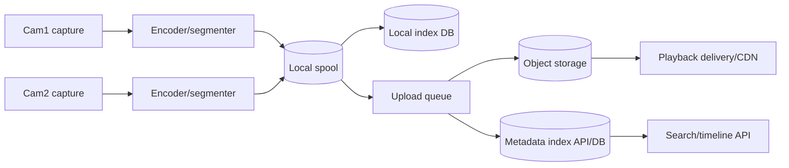

# Production Video Storage Blueprint (v1.0.0)

## Goal

Define a practical, production-grade storage design for this Jetson Nano dual-camera dashboard that supports:

- reliable clip recording and recovery
- efficient cloud/object-storage upload
- searchable playback metadata
- cost-controlled retention lifecycle
- optional compliance-grade immutability (WORM / legal hold)

This blueprint is implementation-oriented and mapped to the current repo architecture.

---

## 1) Reference architecture (Jetson-friendly)

### Why this is standard in production

1. Capture and upload are decoupled (spool + queue), so network outages do not drop recordings.
2. Segmented objects improve retry granularity and timeline seek.
3. Metadata index allows fast search without scanning object storage.
4. Lifecycle and immutability are policy-driven (not custom ad-hoc scripts).

---

## 2) Recording format and segment defaults

### Recommended defaults for this project

- **Container**: MP4 for operator playback simplicity.
- **Segment duration**: **60s** (good balance of latency, object count, and recovery scope).
- **File naming**: monotonic segment sequence plus UTC start time.
- **Upload trigger**: segment finalized event.

### Camera defaults (current perf-aligned)

- cam1: 640x480 @ 30 fps
- cam2: 640x480 @ 30 fps (or capped lower when IR sensor path is unstable)

> Note: very small segments (<10s) increase request overhead and index pressure. Very large segments (>5 min) increase re-upload blast radius after interruption.

---

## 3) Object key naming scheme (hot-spot resistant)

Use distributed prefixes to avoid partition hot spots at high write rate.

Pattern:

`v1/{site}/{camera}/{yyyy}/{mm}/{dd}/{hh}/{hash2}/{run_id}/{start_ts}_{seq}.mp4`

Example:

`v1/lab-a/cam2/2026/07/29/12/7f/run_20260729T120530Z/20260729T120530Z_000123.mp4`

Where:

- `hash2` = first 2 hex chars of SHA-1(`run_id + seq + camera`)
- `start_ts` = segment start UTC in compact ISO

Benefits:

- predictable time partitioning for lifecycle/reporting
- distributed prefix for high PUT concurrency
- deterministic lookup path from metadata index

---

## 4) Metadata index schema (minimum viable)

Use SQLite locally first (Jetson), with optional sync to central DB.

Table: `video_segments`

- `id` (uuid)
- `run_id` (text)
- `camera_id` (text)
- `segment_seq` (int)
- `start_ts_utc` (text)
- `end_ts_utc` (text)
- `duration_ms` (int)
- `codec` (text)
- `width` (int)
- `height` (int)
- `fps` (real)
- `object_key` (text)
- `etag_or_checksum` (text)
- `upload_state` (queued|uploading|uploaded|failed)
- `retry_count` (int)
- `retention_class` (hot|warm|archive|compliance)
- `created_at` (text)

Optional table: `segment_events` for diagnostics (`segment_finalized`, `upload_retry`, `upload_failed`, etc.).

---

## 5) Upload policy (resilient by default)

### Worker behavior

- Background uploader processes finalized segments only.
- Max parallel uploads: **2 per camera** (start conservative on Nano).
- Retry strategy: exponential backoff with jitter.

Suggested retry delays (seconds):

- 1, 2, 4, 8, 16, 30, 30 (cap)

Failover rules:

- transient network/throttling: retry
- auth/config error: mark permanent failure + alert

### Integrity

- store segment checksum locally before upload
- verify ETag/checksum when provider supports it
- mark uploaded only after durable provider acknowledgment

---

## 6) Retention and lifecycle policy template

Use data class tags (or metadata fields) to drive lifecycle:

- `hot`: recent operator playback
- `warm`: infrequent review
- `archive`: long-term low-cost retention
- `compliance`: immutable retention + legal hold when required

### Suggested default windows

- hot: 0–7 days
- warm: 8–30 days
- archive: 31–180 days
- delete: >180 days (unless legal/compliance hold)

### Cloud policy notes

- S3/Azure lifecycle actions are asynchronous and policy-based.
- Plan for minimum-duration charges in infrequent/archive tiers.
- Keep object size/segment duration balanced to avoid small-object cost explosion.

---

## 7) Immutability / legal hold strategy

For compliance-sensitive experiments:

1. upload into dedicated compliance container/bucket prefix
2. apply time-based retention (WORM)
3. apply legal hold for unknown-duration investigations
4. keep operational logs + policy-audit evidence

Operational caution:

- Locking immutable policy should follow short validation phase.
- Versioning and deletion semantics must be documented for operators.

---

## 8) Recovery workflow (power/network interruption)

On service startup:

1. scan spool directory for finalized but unindexed files
2. reconstruct index entries from filename + probe metadata
3. resume uploads for `queued/failed` segments
4. quarantine corrupted/incomplete files for manual review

Rules:

- never delete local segment unless remote upload marked durable
- never block live stream path on upload failure

---

## 9) Repo integration plan (where to implement)

### Backend

- `backend/app/camera.py`
  - emit segment-finalized callback/event
- `backend/app/main.py`
  - new endpoints: upload queue status, segment timeline query
- `backend/app/event_logger.py`
  - add segment/upload structured events
- `backend/app/config.py`
  - add storage/lifecycle env toggles
- **new** `backend/app/storage_uploader.py`
  - upload worker + retry + checksum handling
- **new** `backend/app/segment_index.py`
  - SQLite index management

### Frontend

- `frontend/src/components/VideoStream.jsx`
  - optional timeline markers/recording badges
- **new** small panel component for recording/upload health

### Deployment

- `.env.example`
  - add object-storage credentials placeholders + lifecycle toggles
- `DEPLOYMENT.md`
  - add retention/compliance operation section

---

## 10) Suggested new env variables

- `VIDEO_SEGMENT_SECONDS=60`
- `VIDEO_UPLOAD_MAX_PARALLEL_PER_CAMERA=2`
- `VIDEO_UPLOAD_MAX_RETRIES=7`
- `VIDEO_UPLOAD_RETRY_BASE_SECONDS=1`
- `VIDEO_STORAGE_PROVIDER=s3|azure|local`
- `VIDEO_STORAGE_BUCKET_OR_CONTAINER=`
- `VIDEO_STORAGE_PREFIX=v1/lab-a`
- `VIDEO_RETENTION_HOT_DAYS=7`
- `VIDEO_RETENTION_WARM_DAYS=30`
- `VIDEO_RETENTION_ARCHIVE_DAYS=180`
- `VIDEO_COMPLIANCE_MODE=off|governance|compliance`

---

## 11) Validation checklist

- recording ON does not noticeably degrade live preview
- network disconnect/reconnect preserves and later uploads backlog
- duplicate upload attempts remain idempotent
- timeline API returns contiguous segment ranges per run/camera
- lifecycle policy dry-run reviewed before destructive deletes
- compliance mode tested in non-production account first

---

## 12) Source guidance used

- RFC 8216 (HLS): segment + playlist behavior
- AWS S3: performance, lifecycle, object lock docs
- Azure Blob: performance checklist, partitioning, lifecycle, immutability docs

(See conversation research summary for direct links.)
