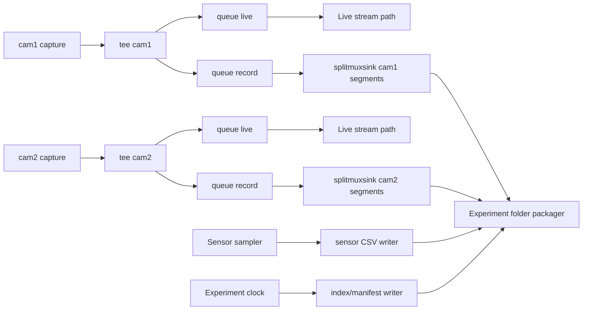

# Scalable Experiment Recording Architecture (v1.4.0)

## Goal

Design a robust recording architecture that preserves **dual-camera live smoothness** while enabling:

- synchronized experiment evidence (cam1 + cam2 video, timestamp track, sensor CSV)
- crash-safe file writing and retention
- non-blocking operation under IO jitter
- optional remote copy/download workflows

This proposal is research-backed and intentionally incremental so it can be rolled out without regressing current field behavior.

---

## Current constraints and design principles

1. Live preview must stay responsive (operator control first).
2. Recording must never block live streaming path.
3. Camera instability risk is higher on some accelerated conversion branches; defaults should favor stable capture and isolate optional recording transforms.
4. Files must remain recoverable even if power/network/process interrupts occur.

---

## Evidence-backed media design

### 1) Branch isolation with `tee` + per-branch `queue`

Use one capture source per logical camera and split with `tee`.

- GStreamer `tee` guidance: each branch should have its own `queue` to avoid cross-branch stalling.
- This is mandatory for live smoothness when one branch is slower (disk/network) than another (preview).

### 2) Segmented writer with `splitmuxsink`

Record in bounded segments instead of one giant file.

- use `max-size-time` for fixed-length chunks
- use `max-files` for ring retention
- use async finalize mode where supported to reduce stalls during segment rollover

### 3) MP4 durability choices (`qtmux` / `mp4mux` family)

For MP4 survivability and playback ergonomics:

- prefer mux settings that support robust/recoverable moov updates where available
- use `faststart` when operator workflows require immediate playability after close
- if crash recovery is needed in an interrupted write scenario, use recovery-oriented options (`moov-recovery-file`, robust reserve/update options) where plugin/version supports them

### 4) Backpressure policy

For recording branches, choose bounded queues and explicit drop policies over unbounded growth.

- live branch: low-latency queue settings
- record branch: larger queue with clear limits and overrun observability

---

## Proposed pipeline topology

---

## Experiment data model

Per run, create:

- `runs/<run_id>/cam1/segment_0001.mp4 ...`
- `runs/<run_id>/cam2/segment_0001.mp4 ...`
- `runs/<run_id>/sensors.csv`
- `runs/<run_id>/manifest.json`

`manifest.json` should include:

- run metadata (operator, site, config snapshot, software version)
- camera mapping (`cam1` device, `cam2` device)
- segment timeline (`start_ts`, `end_ts`, file)
- sensor schema + sampling interval
- checksum list for integrity verification

---

## Timestamp and synchronization strategy

1. Use backend monotonic clock as canonical run clock.
2. Stamp each recorded frame with capture timestamp metadata (or sidecar index if overlay is disabled).
3. Sensor rows include both wall-clock ISO time and monotonic offset.
4. Manifest aligns camera segment boundaries to sensor windows.

This supports accurate post-analysis even if wall-clock adjustments occur.

---

## Compression and storage strategy

### Phase A (safe baseline)

- MP4 segments at conservative bitrate
- bounded local retention by run count + disk watermark
- scheduled cleanup of oldest runs when thresholds exceed

### Phase B (optional optimization)

- per-camera bitrate profiles (cam2 may use lower bitrate if IR/utility stream)
- optional post-run transcode for archival tier
- optional upload to remote NAS/object storage

---

## Non-blocking control-plane design

Recording orchestration should be async and stateful:

- `POST /api/experiments/start`
- `POST /api/experiments/stop`
- `GET /api/experiments/active`
- `GET /api/experiments/history`
- `GET /api/experiments/{id}/artifacts`

A background worker manages:

- segment rollover events
- manifest incremental commits
- retention checks
- optional upload queue

---

## Safety and failure handling

- if recording branch fails, live branch stays active (strict branch isolation)
- emit structured events for queue overrun/underrun, segment finalize errors, disk-low conditions
- when run finalization fails partially, keep run as `state=degraded` with recoverable artifact map
- on restart, perform run journal reconciliation and continue safe cleanup

---

## UI/UX plan (modern operator flow)

1. **Experiment Control Bar**
   - Run name, tags, start/stop, elapsed time
2. **Dual Stream Status Cards**
   - cam1/cam2 FPS, recording state, segment index, dropped frame counters
3. **Sensor Sync Panel**
   - live values + sampling health + write latency
4. **Run History Drawer**
   - searchable runs, health badges, download/export actions

---

## Incremental rollout plan

### Milestone 1

- API scaffolding + run manifest writer
- sensor CSV writer per run
- no video recording yet (control-plane validation)

### Milestone 2

- add cam1 segmented recording with isolated queue
- retention watermark checks

### Milestone 3

- add cam2 segmented recording
- dual-camera run integrity checks

### Milestone 4

- UI run history/download
- optional remote upload worker

---

## Validation checklist

- live stream latency delta with recording ON remains within acceptable threshold
- forced disk throttling does not freeze live preview
- abrupt process stop still leaves recoverable segments/manifest state
- retention pruning never deletes active run artifacts
- run download package contains complete and checksummed files

---

## References (research sources)

- GStreamer `tee` docs (branch + queue requirement)
- GStreamer `queue` docs (thread decoupling, limits, leaky modes)
- GStreamer `splitmuxsink` docs (segmented writing, max-size-time/max-files, finalize behavior)
- GStreamer `qtmux` / `GstBaseQTMux` docs (faststart, moov recovery, robust muxing options)
- GStreamer `qtmoovrecover` docs (recovery utility for interrupted muxing cases)
- OpenCV VideoWriter reference (writer behavior and backend constraints)
- FFmpeg tee/fifo muxer references (cross-check for decoupled multi-output patterns)
