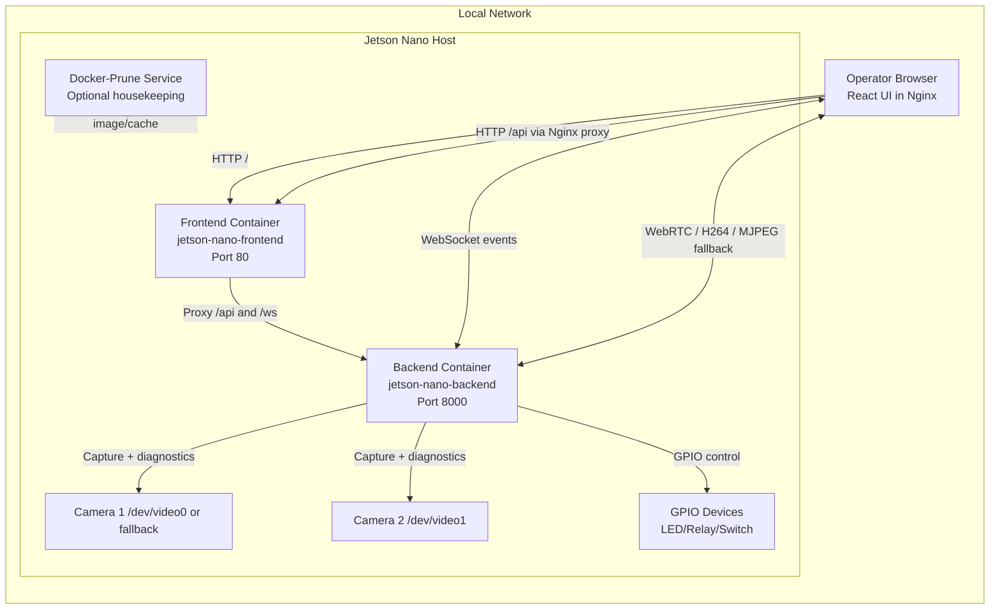
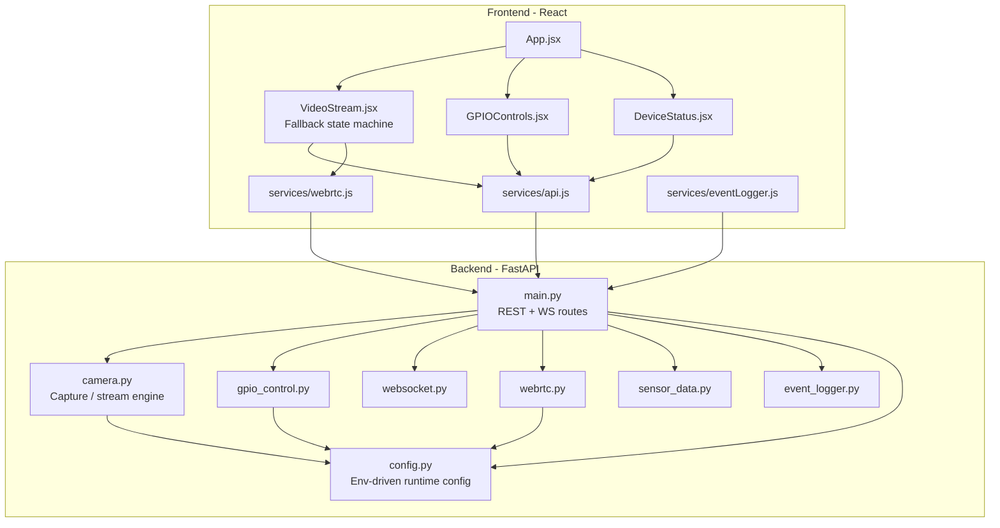
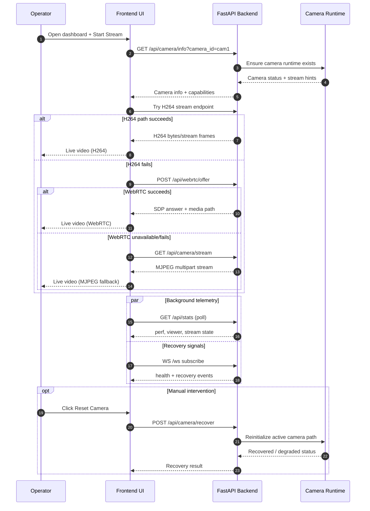

# Software Architecture and Application Flow (v1.0.0)

This document provides branch-aligned architecture diagrams for the Jetson Nano WebRTC Dashboard.

---

## 1) System / Deployment Architecture

---

## 2) Software Architecture (Component View)

---

## 3) Application Flow (Live Stream + Fallback + Recovery)

---

## 4) Optional future extension (recording/storage path)

The approved design direction for production video storage is documented separately in:

- `Doc/production-video-storage-blueprint-v1.0.0.md`

That extension adds segmented recording, upload queue, metadata index, and lifecycle governance without blocking current live streaming behavior.
